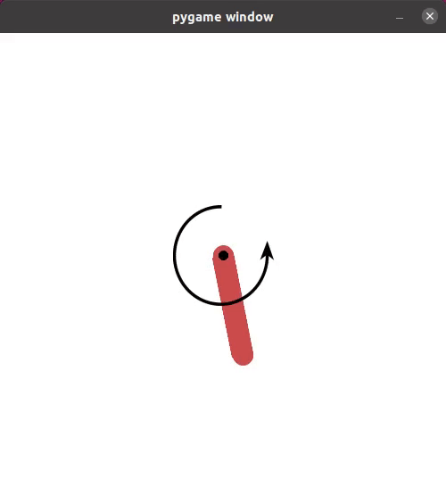

# Pendulum PPO

This is an implementation of the [Proximal Policy Optimization Algorithm](https://arxiv.org/abs/1707.06347) (PPO-clip). It is a simple implementation without many tricks and works on the Open AI Gym [Pendulum-v1](https://www.gymlibrary.ml/environments/classic_control/pendulum/) environment.

## Create Conda env and install dependencies
`conda create -n rl_env python=3.8.8`

`conda activate rl_env`

`pip install -r requirements.txt`

## Train and visualize trained agent

With the default arguments, you should be able to train a successful Pendulum-v1 agent.

`python main.py`

To visualize performance of trained agent, run:

`python main.py --play <checkpoint directory>`

e.g. `python main.py --play 220526115934160790`

